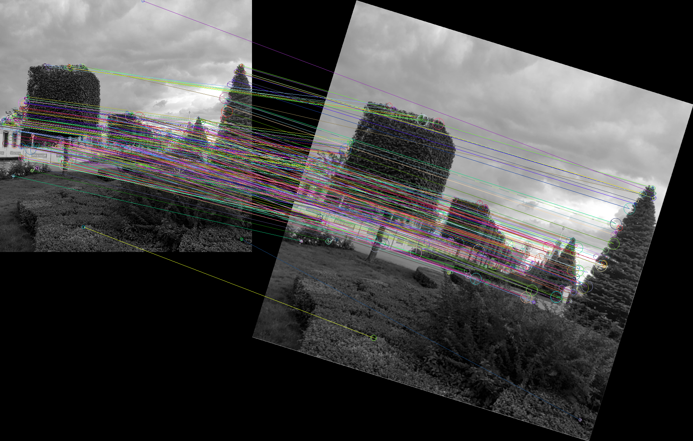

# SIFT

This library implements an algorithm described in a paper of the same name:

Lowe, D.G. Distinctive Image Features from Scale-Invariant
Keypoints. International Journal of Computer Vision 60, 91–110
(2004). https://doi.org/10.1023/B:VISI.0000029664.99615.94

Its purpose is to find and describe keypoints on an image which are invariant to
linear transforms applied to the image.

